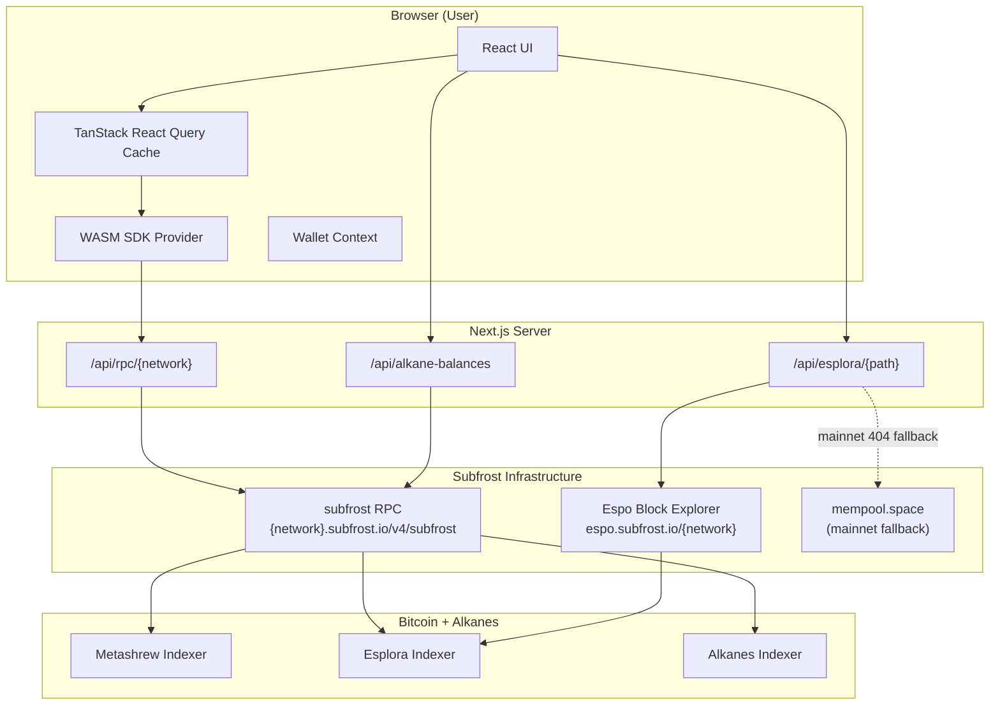
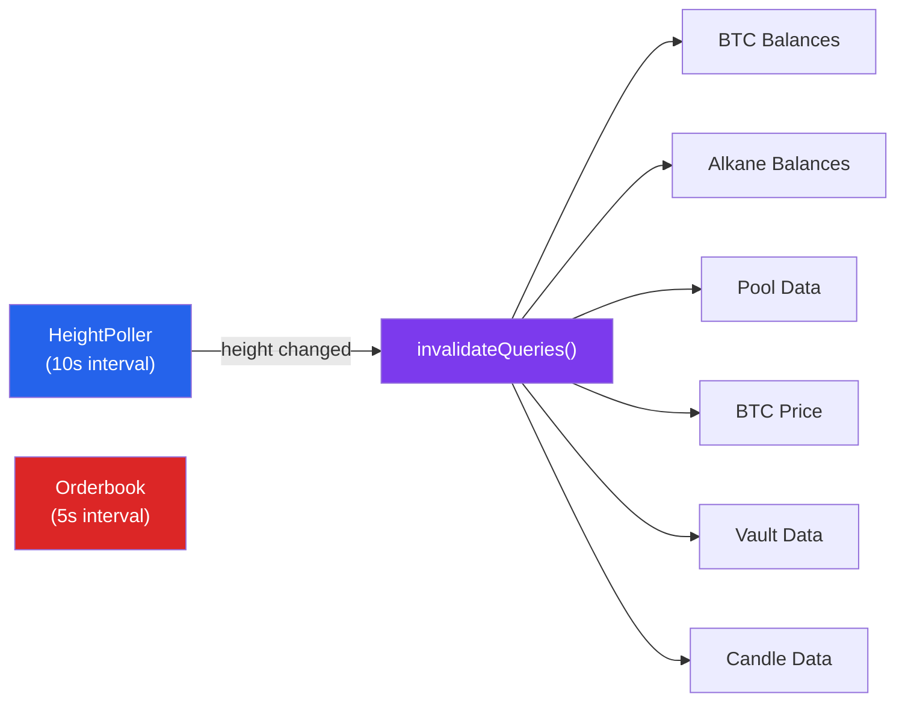
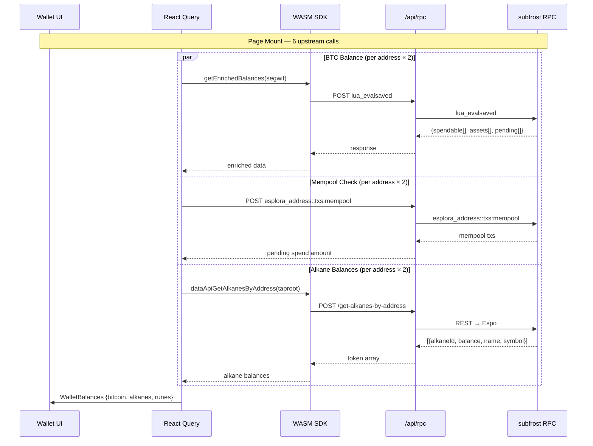
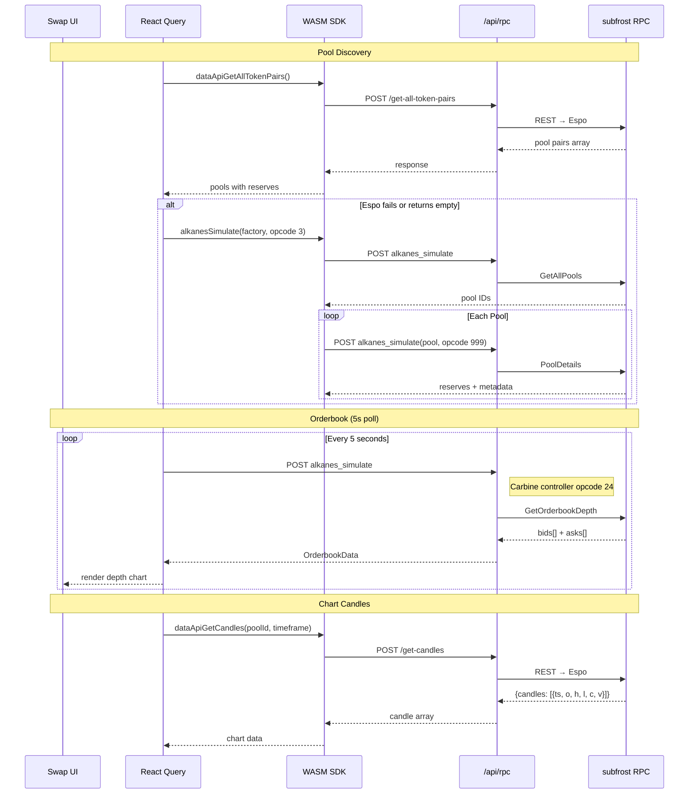
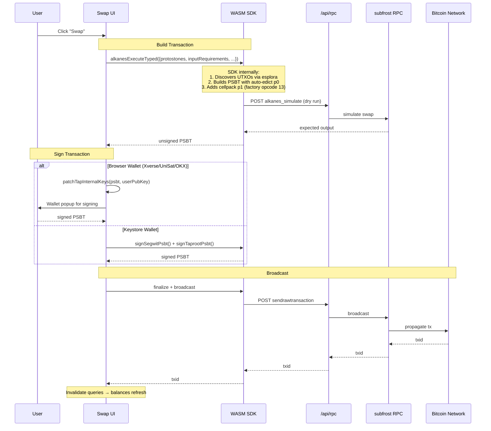
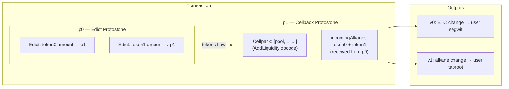
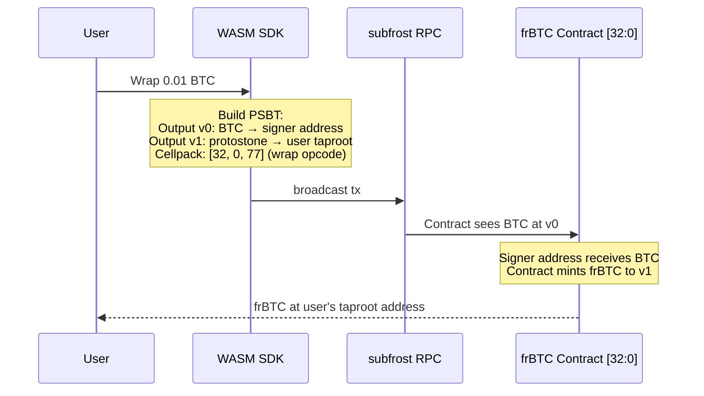
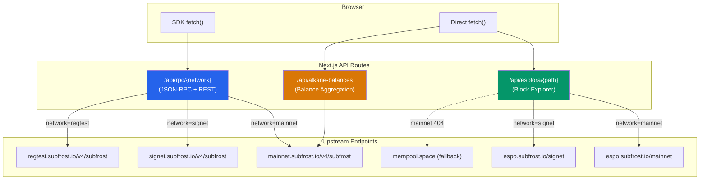
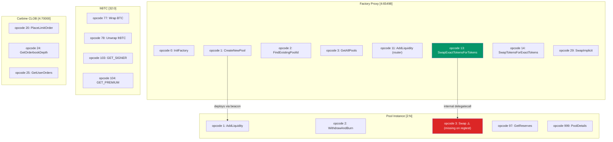

# Subfrost App — Production Data Flow Architecture

## System Overview

## Query Invalidation Model

**Only two independent pollers exist on production:**
- **HeightPoller** (10s) — when height changes, invalidates everything else
- **Orderbook** (5s) — must poll independently (CLOB latency requirement)

All other queries use `staleTime: Infinity` and refresh only on height change.

## Read Flows (Queries)

### Wallet Page Load

### Swap Page Load

## Write Flows (Mutations)

### Swap Execution

### Two-Protostone Pattern (Add Liquidity / Create Pool)

### BTC Wrap Flow

## Proxy Routing

## AMM Contract Call Map

## Request Fan-Out Summary

| Event | Upstream Calls | Via | Trigger |
|-------|---------------|-----|---------|
| Page load (wallet) | 6 | `/api/rpc` | Mount |
| Height poll | 1 | `/api/rpc` | 10s interval |
| Height change | ~8 | `/api/rpc` | Invalidation cascade |
| Orderbook poll | 1 | `/api/rpc` | 5s interval |
| Swap execution | ~4 | `/api/rpc` | User action |
| UTXO fetch (send) | 2-50 | `/api/esplora` | User action |
| Pool discovery | 1-N | `/api/rpc` | Height change |
| Candle fetch | 1 | `/api/rpc` | Height change |
